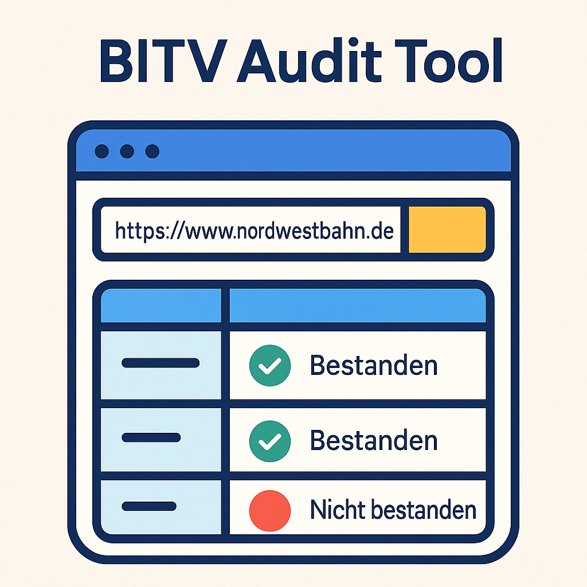

# BITV Audit Tool

<div align="center" style="margin-bottom: 2rem;">
  
</div>


An automated accessibility testing tool for web applications, specifically designed to check compliance with BITV 2.0 (German Barrier-Free Information Technology Ordinance) and EN 301 549 standards.

## Features

- Automated accessibility checks based on BITV 2.0 and EN 301 549 criteria
- Comprehensive PDF report generation
- Visual evidence capture through screenshots
- Contrast ratio analysis
- Structured error categorization
- Weighted scoring system
- Multi-language support (English and German)
- Environment-based configuration

## Technical Details

- Built with Node.js and Puppeteer
- PDF report generation
- Screenshot capabilities
- Color contrast analysis
- DOM structure validation
- ARIA attributes verification
- Environment variable support

## Installation

```bash
yarn install
```

## Configuration

1. Create a `.env` file in the root directory (you can copy from `.env.example`):
```bash
cp .env.example .env
```

2. Configure the environment variables:
```env
# URL for BITV compliance testing
TARGET_URL=https://example.com

# Additional configurations
NODE_ENV=development
```

## Usage

There are two ways to run the tool:

1. Using the main script:
```bash
yarn start
```

2. Using the PDF generator directly:
```bash
node src/utils/generate-pdf.js
```

The tool will:
1. Read configuration from `.env` file
2. Perform accessibility checks on the specified URL
3. Generate detailed JSON report
4. Create PDF documentation
5. Save screenshots of identified issues

## Output

- Detailed JSON report (`data.json`)
- PDF report (`reports/bitv-report.pdf`)
- Screenshots of accessibility issues
- Compliance score and status

## Categories

Checks are organized into four main categories:
- Perceivable
- Operable
- Understandable
- Robust

## Severity Levels

Issues are classified into:
- Critical: Prevents access for certain user groups
- High: Significantly impairs accessibility
- Medium: Moderately affects accessibility
- Low: Minor accessibility concerns

## Development

### Code Style

The project uses Biome for code formatting and linting. Available commands:

```bash
# Format code
yarn format

# Check formatting
yarn format:check

# Lint code
yarn lint

# Check and apply fixes
yarn check

# CI check
yarn check:ci
```

## About

Developed by [Pixelcoda](https://pixelcoda.de), a professional web development company specializing in accessibility and web standards.

## Support

For professional support or custom development inquiries, please contact:
- Website: [https://pixelcoda.de](https://pixelcoda.de)
- GitHub: [https://github.com/CasianBlanaru/bitv-audit-tool](https://github.com/CasianBlanaru/bitv-audit-tool)

## License

MIT License

## Contributing

Contributions are welcome. Please open an issue first to discuss proposed changes. 